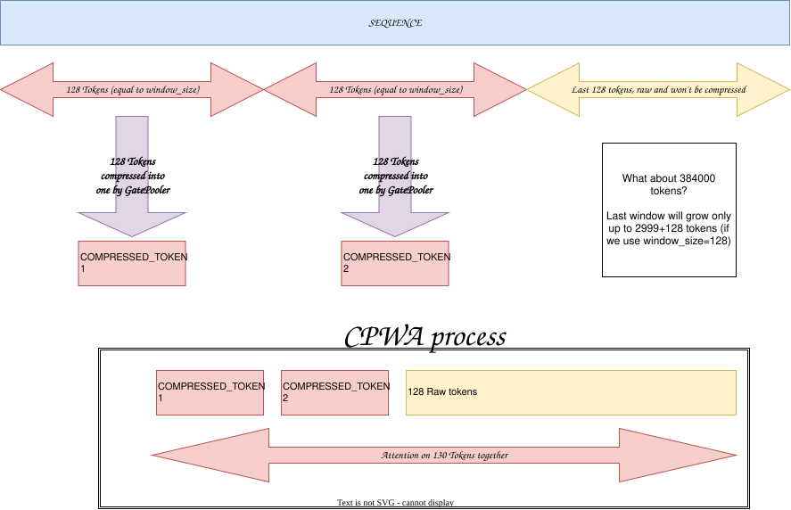
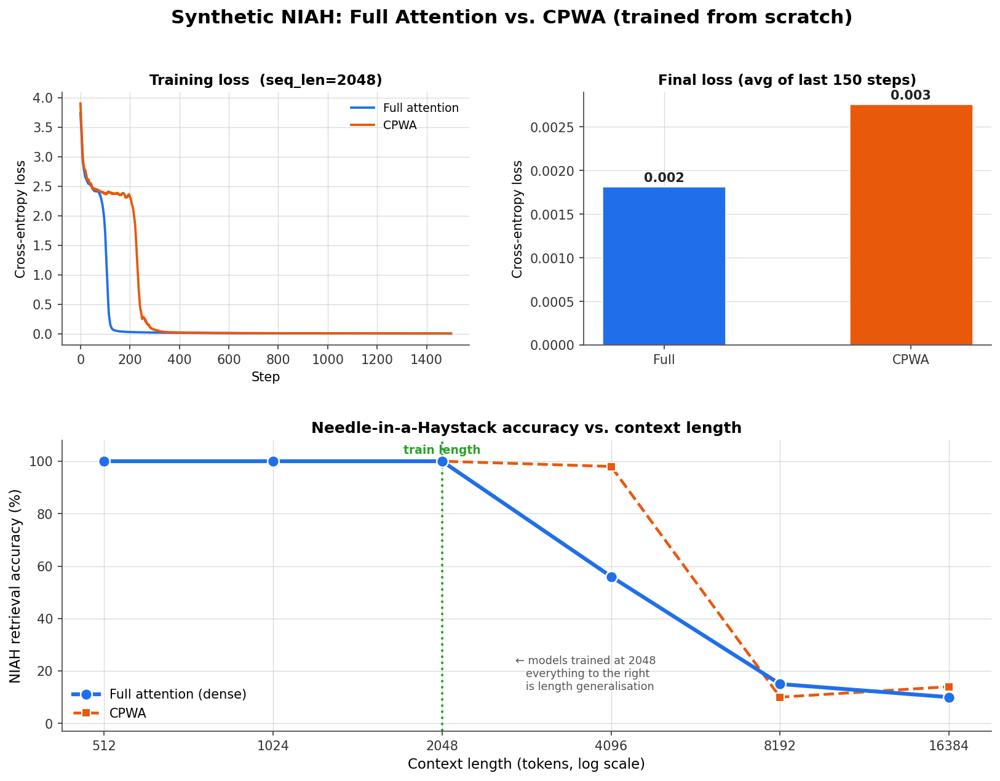

# Compressed‑Prefix Window Attention (CPWA)

**CPWA** is a novel attention mechanism that compresses completed blocks of tokens into compact summaries while keeping full causal attention inside the current window.  

It delivers:
- **Strong length generalisation** (98% NIAH accuracy at 2× training length vs 56% for full attention)
- **Coherent language modelling** even with limited training
- **Significantly better efficiency** than dense attention: O(T·B + T²/B)
---

## Overview

Given a sequence of tokens, CPWA divides it into non‑overlapping blocks of fixed size `B` (e.g., 128). For each *completed* block, a **gated pooler** compresses it into a single vector. At any point, the *live* context consists of:

- A **compressed prefix** – one vector per completed block, summarising all tokens in that block.
- A **raw window** – the current incomplete block of up to `B` raw tokens.

The layer performs attention where:
- **Raw tokens** attend to **all compressed vectors** from the past **and** causally to each other in the current window.
- **Compressed tokens** used as k/v

This yields **O(T·B + T²/B)** training complexity (instead of O(T²)) and **O(T/B)** memory for the compressed history, while retaining full access to the entire past.




## Results: CPWA Shows Strong Length Generalisation and Coherent Language Modelling

### 1. Synthetic Needle-in-a-Haystack (length generalisation and past-retrive task)

Both Full Attention and CPWA were trained from scratch for 1500 steps on sequences of length 2048, and window size of 128.  
They were then evaluated zero-shot on longer contexts (pure length extrapolation).


| Context length | Full Attention | CPWA     |
|----------------|----------------|----------|
| 512            | 100.0%         | 100.0%   |
| 1024           | 100.0%         | 100.0%   |
| 2048 (train)   | 100.0%         | 100.0%   |
| **4096 (2×)**  | 56.0%          | **98.0%**|
| 8192           | 15.0%          | 10.0%    |
| 16384          | 10.0%          | 14.0%    |

**Key takeaway:**  
At 2× the training length, CPWA retains almost perfect retrieval accuracy while dense attention collapses.  
This is direct evidence that the compressed prefix successfully carries the critical information across long distances.
My tests showed that NIAH test is working, so I'll be relying on it.

### 2. Language modelling

| Training mode | Loss |
|---------------|------|
| Pre-training(fineweb)  | 3.5  |
| Fine-tune     | 3.0  |


**Generation example**

*That's really impressed me, because answer is coherent, and factually true, for 400M training tokens this is a lot*

Prompt:
```
####Human####:
What's the most popular programming language?

####Assistant####: 
```

Result:
```
####Human####:
What's the most popular programming language?

####Assistant####: 
In terms of coding, there are several popular programming languages that can be used to create a user experience. Some popular programming languages include Python, JavaScript, Java, and JavaScript.
```
Model was finetuned on small amount of examples(20M tokens) and non-optimized finetune strategy, but still managed to get those good results. (I'll run training for longer time, this is pre-release, but it will take a while because I have access only to free T4 in google colab.

More examples (including longer conversations) can be found in `Gen_examples.txt`.


### 3. Qualitative Confirmation of Long-Context Behaviour

Even in conversations longer than the window size `Gen_examples.txt`, the model does **not** jump between topics or lose earlier context.  
This is further practical evidence that the compressed prefix is functioning as intended and successfully preserving information beyond the raw window.

### 4. Model Checkpoint
The finetuned model checkpoint can be downloaded from the [Releases](../../releases) page.

---


## Key Components

### 1. Gated Pooler (block compressor)
For each block of `B` token embeddings `X ∈ ℝ^(B×D)`, it computes:

- **Gate logits**: `G = gate(X + pos_emb)`  
  (positional embedding inside the block)
- **Softmax weights** (per‑channel):  
  `W = softmax(G, dim=0)`   – each feature dimension learns its own attention over positions.
- **Values**: `V = value_proj(X)`
- **Compressed vector**: `c = Σ (W ⊙ V)`, then `LayerNorm`

This is *not* simple averaging or max pooling – it learns which positions in the block are most informative per channel.

### 2. Compressed Prefix Windowed Attention (CPWA)
The combined sequence is arranged as:

```
[compressed_0, compressed_1, …, compressed_k, raw_0, raw_1, …, raw_{m-1}]
```

where `k` = number of completed blocks, `m` = number of tokens in current window.
**Intuition**: Compressed vectors represent the *past* and are fixed; raw tokens see the entire past at low cost, while compressed tokens stay independent of future raw content (cache‑stable for generation).

### 3. Rotary Position Embeddings (RoPE)
- **Raw tokens** get RoPE at their true global position.
- **Compressed token `i`** gets RoPE at the **end position** of its block (`(i+1)*B - 1`), preserving relative‑distance semantics.

---

## Benefits

| Feature | Benefit |
|---------|---------|
| **Quadratic complexity, but with high constant, and precise past recall** | O(T·B + T²/B) – scales to long contexts. |
| **Full past access** | Raw tokens see the entire history via compressed summaries. |
| **Low memory** | Stores only `T·B + T²/B` compressed vectors + one window. |
| **No position‑emb table** | RoPE handles positions without extra parameters. |

---

## Code Integration

The layer is implemented in PyTorch as:

- `CPWAAttention` – the hierarchical attention mechanism.
- `GatedPooler` – the block compressor.
- `CPWA` – a full transformer block combining pre‑norm, CPWA attention, and SwiGLU FFN.
- `CPWAModel` – the full language model with embedding, stack of CPWA layers, and output head.

**Example config:**
```python
cfg = CPWAConfig(
    vocab_size=50257,
    seq_len=2048,
    n_layer=6,
    n_head=4,
    n_embd=512,
    window_size=128,
    d_ff_mult=4,
)
model = CPWAModel(cfg)
```

---

## References

- Rotary Position Embedding (RoPE) – Su et al.
- Sliding window attention (used in Longformer, Mistral).
- Gated pooling – inspired by attention pooling, but per‑channel.

**CPWA combines these ideas into a single, efficient layer that learns to summarise the past while preserving causal attention on the present.**
